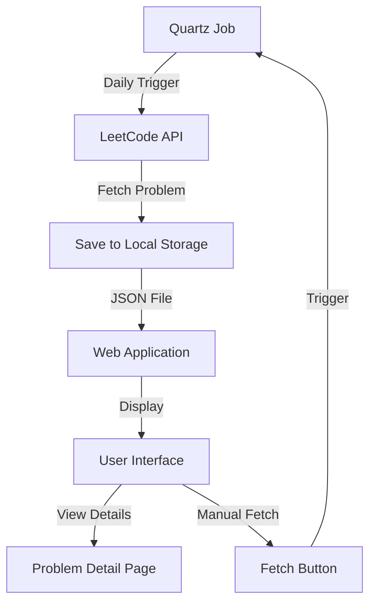
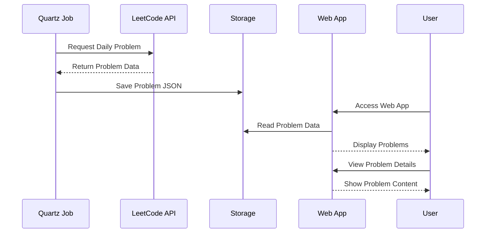

# LeetCode Daily Problem Tracker

A web application that automatically fetches and tracks daily LeetCode problems, allowing users to view problem details, solutions, and track their progress.

## Table of Contents
- [Features](#features)
- [Architecture](#architecture)
- [Technology Stack](#technology-stack)
- [Project Structure](#project-structure)
- [Getting Started](#getting-started)
- [Development](#development)
- [Deployment](#deployment)
- [Contributing](#contributing)
- [License](#license)

## Features
- 🎯 Daily LeetCode problem tracking
- 📝 Detailed problem descriptions and examples
- 💡 Solution tracking
- 🔄 Automatic problem fetching
- 📊 Progress tracking
- 🌐 Modern web interface

## Architecture

### System Flow


### Data Flow


## Technology Stack
- **Backend**: .NET 9, Blazor Server
- **Frontend**: Blazor Components, Bootstrap 5
- **Scheduling**: Quartz.NET
- **Storage**: File System (JSON)
- **API Integration**: LeetCode GraphQL API
- **Error Handling**: Polly (Retry Policy)

## Project Structure
```
LeetCodeDaily/
├── LeetCodeDaily.Web/           # Main web application
│   ├── Components/              # Blazor components
│   │   ├── Pages/              # Page components
│   │   └── Layout/             # Layout components
│   ├── Services/               # Business logic services
│   ├── Models/                 # Data models
│   ├── Jobs/                   # Background jobs
│   └── Solutions/              # Problem solutions storage
└── README.md                   # Project documentation
```

## Getting Started

### Prerequisites
- .NET 9 SDK
- Visual Studio 2022 or VS Code
- Git

### Installation
1. Clone the repository:
   ```bash
   git clone https://github.com/yourusername/LeetCodeDaily.git
   ```

2. Navigate to the project directory:
   ```bash
   cd LeetCodeDaily
   ```

3. Restore dependencies:
   ```bash
   dotnet restore
   ```

4. Run the application:
   ```bash
   dotnet run --project LeetCodeDaily.Web
   ```

5. Open your browser and navigate to:
   ```
   https://localhost:7131
   ```

## Development

### Key Components
- **LeetCodeService**: Handles communication with LeetCode API
- **DailyProblemJob**: Quartz job for fetching daily problems
- **LeetCodeProblems.razor**: Main problem list page
- **LeetCodeProblemDetail.razor**: Problem detail page

### Adding New Features
1. Create feature branch
2. Implement changes
3. Add tests if applicable
4. Submit pull request

## Deployment
The application can be deployed to any environment that supports .NET 9:
- Azure App Service
- Docker containers
- Self-hosted servers

### Docker Deployment
```bash
docker build -t leetcodedaily .
docker run -p 8080:80 leetcodedaily
```

## Contributing
1. Fork the repository
2. Create your feature branch
3. Commit your changes
4. Push to the branch
5. Create a Pull Request

## License
This project is licensed under the MIT License - see the LICENSE file for details.

# Elasticsearch và Kibana Setup

## Yêu cầu
- Docker Desktop đã được cài đặt
- Docker Compose đã được cài đặt

## Cách chạy

1. Khởi động các container:
```bash
docker-compose up -d
```

2. Kiểm tra trạng thái các container:
```bash
docker-compose ps
```

3. Kiểm tra logs:
```bash
docker-compose logs -f
```

4. Truy cập các service:
- Elasticsearch: http://localhost:9200
- Kibana: http://localhost:5601

## Cấu hình

### Elasticsearch
- Port: 9200 (HTTP), 9300 (Transport)
- Memory: 512MB (có thể điều chỉnh trong docker-compose.yml)
- Data được lưu trong volume: elasticsearch-data

### Kibana
- Port: 5601
- Kết nối tự động với Elasticsearch

## Dừng và xóa

1. Dừng các container:
```bash
docker-compose down
```

2. Xóa cả data:
```bash
docker-compose down -v
```

## Troubleshooting

1. Nếu Elasticsearch không khởi động được:
```bash
docker-compose logs elasticsearch
```

2. Nếu Kibana không kết nối được với Elasticsearch:
```bash
docker-compose logs kibana
```

3. Kiểm tra memory:
```bash
docker stats
```

## Backup và Restore

1. Backup data:
```bash
docker run --rm --volumes-from elasticsearch -v $(pwd):/backup alpine tar cvf /backup/elasticsearch-backup.tar /usr/share/elasticsearch/data
```

2. Restore data:
```bash
docker run --rm --volumes-from elasticsearch -v $(pwd):/backup alpine sh -c "cd /usr/share/elasticsearch/data && tar xvf /backup/elasticsearch-backup.tar"
``` 